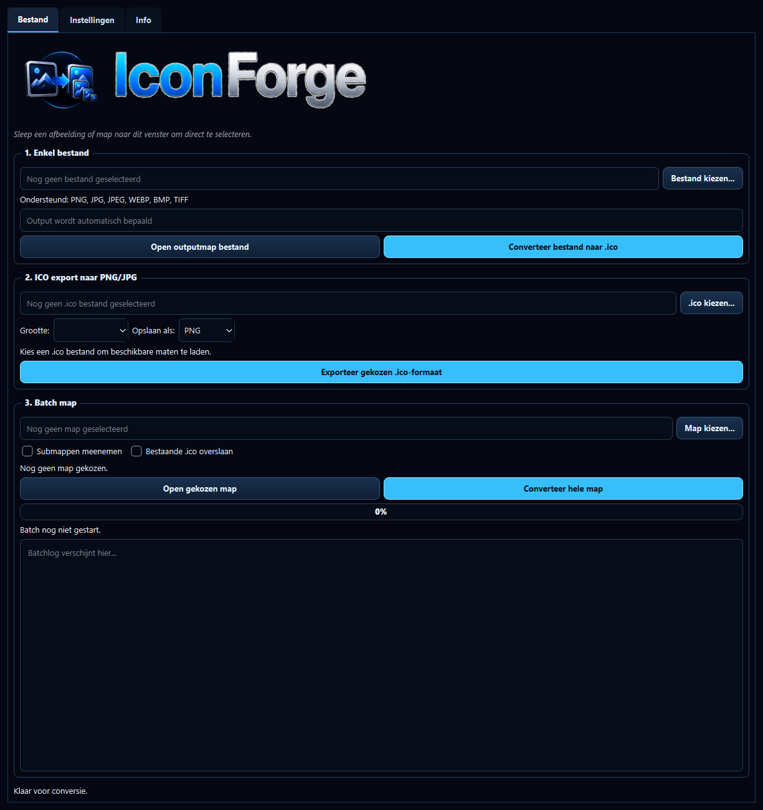

# IconForge


IconForge is een Windows GUI-app voor het omzetten van afbeeldingen naar `.ico` bestanden.



## Versie

- App: `IconForge`
- Versie: `v1.0.0`
- Hoofdscript: `IconForge_v1.0.0_venv_cuda_py311_np2.py`
- Verwachte venv: `venv_cuda_py311_np2`

## Functies

- Enkel afbeeldingsbestand converteren naar `.ico`
- Complete map batchgewijs converteren
- Bestaande `.ico` bestanden openen
- Een beschikbare `.ico` grootte kiezen
- Gekozen `.ico` grootte exporteren naar `.png` of `.jpg`
- Optioneel submappen meenemen
- Optioneel bestaande `.ico` bestanden overslaan
- Meerdere icon-formaten in één `.ico` bestand
- Beeld passend maken zonder afsnijden
- Transparantie behouden waar mogelijk
- Thema's: `CUDA Blue` en `Forge Dark`

## Ondersteunde invoer

- `.png`
- `.jpg`
- `.jpeg`
- `.webp`
- `.bmp`
- `.tiff`

## Starten vanuit Python

```powershell
. C:\Users\ansem\Documents\GitHub\_venvs\venv_cuda_py311_np2\Scripts\Activate.ps1; python .\IconForge_v1.0.0_venv_cuda_py311_np2.py
```

## EXE

De `.exe` wordt als GitHub Release asset gepubliceerd. De app is gebouwd als onefile/windowed build met ingebundelde assets:

- `IconForge.ico`
- `IconForge_logo.png`
- `IconForge_text.png`
- `IconForge.png`

## Build EXE

```powershell
. C:\Users\ansem\Documents\GitHub\_venvs\venv_cuda_py311_np2\Scripts\Activate.ps1; pyinstaller --noconfirm --clean IconForge_v1.0.0.spec
```

## Installer Setup

Installerdefinitie:

```text
IconForge_Setup_v1.0.0.iss
```

Compileren met Inno Setup:

```powershell
iscc .\IconForge_Setup_v1.0.0.iss
```

Output:

```text
installer\IconForge_Setup_v1.0.0.exe
```

De installer wordt ook als GitHub Release asset gepubliceerd.
